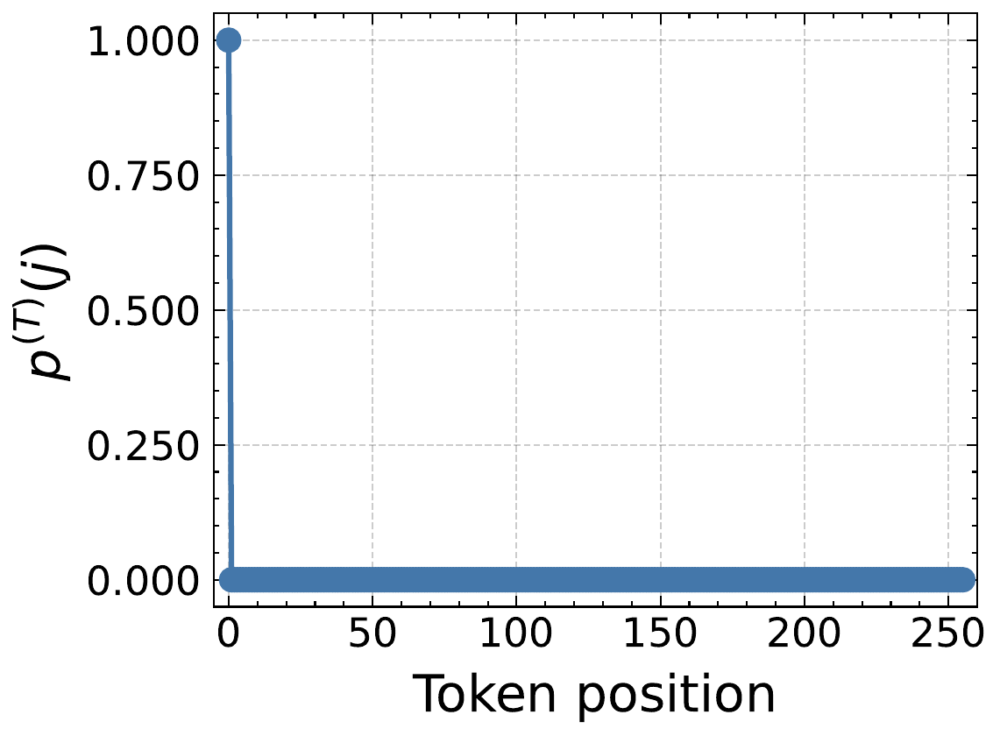
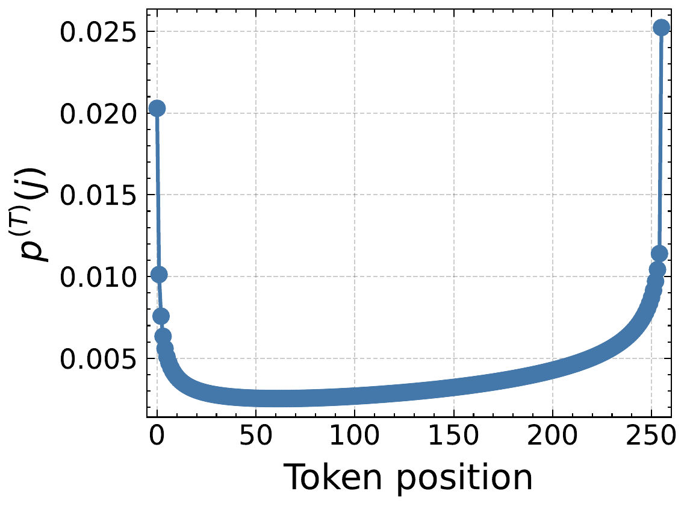
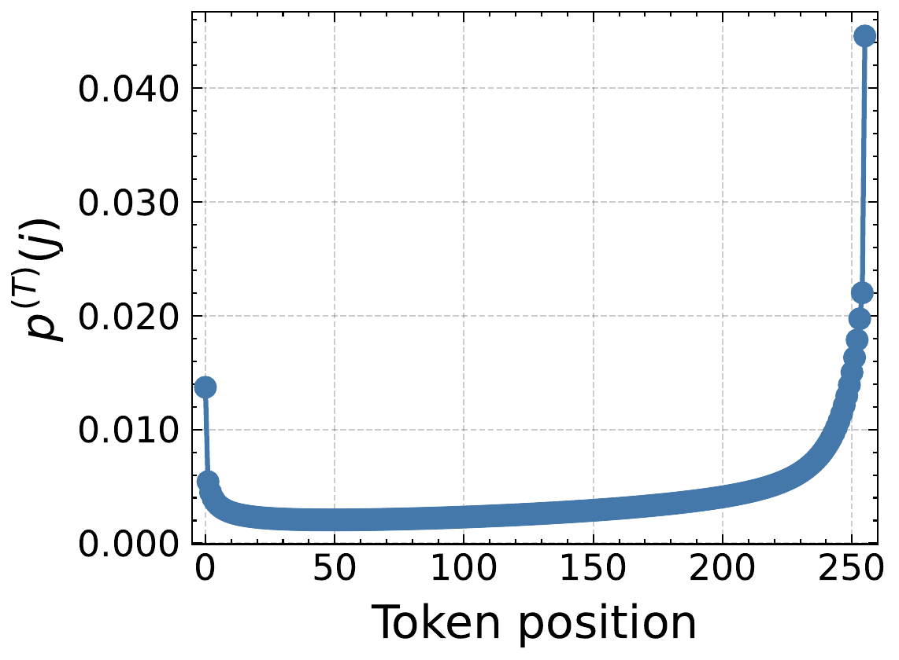
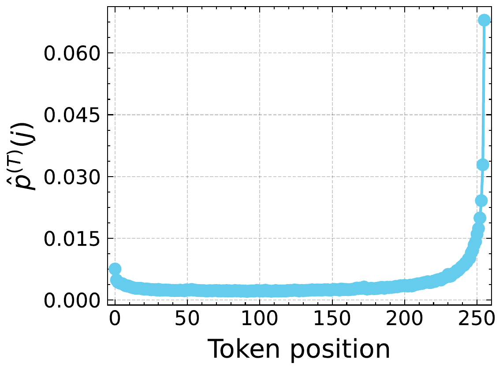

# A Residual-Aware Theory of Position Bias in Transformers

[](%5BLink%5D)
[](./LICENSE)

> **Abstract:** Transformer models systematically favor certain token positions, yet the architectural origins of this position bias remain poorly understood. Under causal masking at infinite depth, prior theoretical analyses of attention rollout predict an inevitable collapse of attention onto the first token. Such collapse, however, does not occur in practice. We resolve this discrepancy with a residual-aware theory of cumulative attention rollout. By incorporating residual connections, we show that this architectural component prevents collapse under realistic conditions. At finite depth, we prove that causal Transformers induce a U-shaped position bias, with attention concentrating on early and late tokens. This provides a principled architectural explanation for the Lost-in-the-Middle phenomenon.

|  |  |  |  |
| :--------------------------------------------------------------------------------------: | :-----------------------------------------------------------------------------: | :-------------------------------------------------------------------------------------------------: | :--------------------------------------------------------------------------------------------------------------------------------: |
|                               Without residual connections                               |                            With residual connections                            |                                     With residuals and content                                      |                                                  Measured on a pre-trained model                                                   |

______________________________________________________________________

## 📢 News

- **[Jan 2026]** Submitted to ICML 2026.

______________________________________________________________________

## 🛠️ Setup

### Installation

You should have [uv](https://docs.astral.sh/uv/) installed.

```bash
# Clone the repo
git clone https://github.com/ml-uhh/position-bias.git
cd position-bias

# Sync environment
uv sync
```

### Data Preparation

All folders used for storing datasets, models, and results are specifiable.
Check the following files to match your local setup:

- `config/*`
- `.env`

______________________________________________________________________

## 🚀 Running

### Measurement Experiments

To run an experiment, which measures values on pre-trained models, use:

```bash
uv run --env-file .env -m src.main config/empirical/example.yaml
```

To run all experiments, use:

```bash
./empirical.sh
```

### Rollout Experiments

To run a rollout experiment, use:

```bash
uv run --env-file .env -m src.rollout.main config/rollout/example.yaml
```

To run all rollout experiments, use:

```bash
./rollout.sh
```

All results will be saved both on wandb and on disk.

### Visualization

To visualize the results from the experiments, use the notebooks provided in `src/visualization/`.

### Reproducing Figures from the Paper

We provide instructions on how to reproduce each figure from the paper in this table:

| Figure        | Description                                                                              | Instructions                                                                                                                                                                                                                         |
| ------------- | ---------------------------------------------------------------------------------------- | ------------------------------------------------------------------------------------------------------------------------------------------------------------------------------------------------------------------------------------ |
| Fig. 1/4      | Measured lambda schedules on pre-trained models                                          | Run any config in `config/empirical/` with `enable_attention_stats: true`. Use `src/visualization/wandb.ipynb` to produce the plots.                                                                                                 |
| Fig. 2/3 (a)  | Rollout distribution without residuals                                                   | Run any config in `config/rollout/` and set `schedule_type` to `constant` and `lambda_const` to `1.0` (or run any config that ends with `-noresidual.yaml`). The ALiBi slopes are computed from the standard slope formula per head. |
| Fig. 2/3 (b)  | Rollout distribution with residuals                                                      | Run any config in `config/rollout/no_content/`. The lambda schedule is taken from the wandb records of the mean residual connection strength per layer.                                                                              |
| Fig. 2/3 (c)  | Rollout distribution with residuals and content                                          | Run any config in `config/rollout/all_content/`. The content per head and layer is converted from the records using `src/visualization/attention_stats.ipynb`.                                                                       |
| Fig. 2/3 (d)  | Rollout distribution measured on pre-trained models                                      | Run any config in `config/empirical/` with `enable_attribution: true`. Use `src/visualization/input_token_influence.ipynb` to produce the plots.                                                                                     |
| Table 2/3/4/5 | Spearman's correlation / Wasserstein distance between measured and theoretical rollouts  | Run any config in `config/empirical/` with `enable_attribution: true` and any config in `config/rollout/all_content/`. Use `src/influence_stats.ipynb` to produce the values.                                                        |
| Table 6       | The similarity within the diagonal and within the off-diagonal of the attention matrices | Run any config in `config/empirical/` with `enable_qk_stats: true`. Values are read from the records using `src/visualization/attention_stats.ipynb`                                                                                 |
| Fig. 5        | Heatmaps of the attention matrices                                                       | Run any config in `config/empirical/` with `enable_qk_stats: true`. Values are read from the records and converted to usable heatmaps using `src/visualization/attention_heatmaps.ipynb`                                             |

## ✒️ Citation

If you find our work useful, please consider citing:

```bibtex
@inproceedings{herasimchyk2026residual,
  title={A Residual-Aware Theory of Position Bias in Transformers},
  author={Herasimchyk, Hanna and Labryga, Robin and Prusina, Tomislav and Laue, Sören},
  booktitle={arXiv preprint arXiv:2602.16837},
  year={2026}
}
```

______________________________________________________________________

## 🚧 Contributing

To contribute you need to install pre-commit hooks.

```bash
uv run pre-commit install
```

To run the pre-commit hooks manually, use

```bash
uv run pre-commit run --all-files
```
